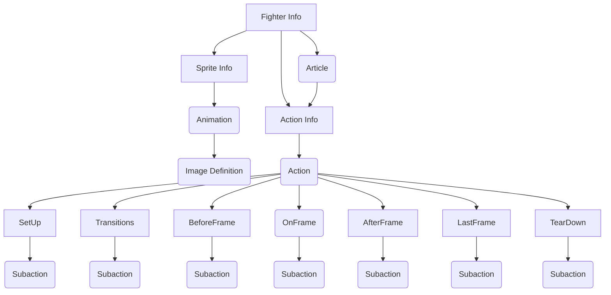

# LegacyEditor
The Character builder for Project TUSSLE

>*This document is still in the process of being finalized and might be missing information*

The purpose of this program is to be a front-end UI for generating fighters for [Project TUSSLE](https://github.com/digiholic/TussleOverdrive). It can read and write the various TUSSLE data formats for fighters, actions, and articles. It organizes the data into sensible groupings and provides features such as drag-and-drop reorganization, drop-down variable selection, and auto-complete.

The Editor uses [Electron](https://www.electronjs.org/) to take advantage of the wealth of styling and compatibility options available with a web-based framework.

## TUSSLE Info Files
The Editor deals with TUSSLE's Info files, which are JSON-serialized Unity classes. As a web-based framework, The Editor can operate on these files as Javascript Objects. These objects will often refer to each other using relative pathing.

>*Viewing this on GitHub? Install [GitHub+Mermaid](https://chrome.google.com/webstore/detail/github-%20-mermaid/goiiopgdnkogdbjmncgedmgpoajilohe?hl=en) to view this chart in-browser.*

The above diagram describes the relationship of the various JSON serializable objects. Rounded rectangles represent a has-many relationship (example: the "Animation" box is rounded to show that there are many animations in a Sprite Info, and the Image Definition is rounded to show there are many Image Definitions in an Animation)

>*TODO create a list of every info file and all of their fields*

## Contributing
To get set up with contributing to the project or on how to report bugs, please see the [Contributing Document](contributing.md)